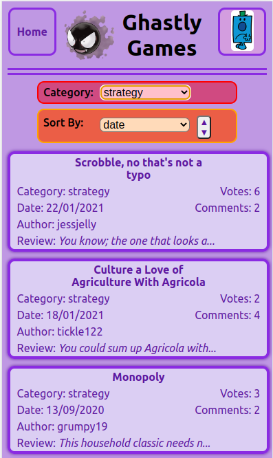

# GhastlyGames

Ghastly Games is a full stack project based on a games content reviewing & discussion website and created using the Create React App :electron:.

<br />
Here is the hosted version of this front-end project: 

###  [Ghastly Games Reviews Website](https://ghastlygamesreviews.netlify.app/)
<br/>

You can link to the back-end Git repository I created here:
###  [GitHub Ghastly-Games-API](https://github.com/MrsCf28/Ghastly-Games-API)
<br />

Here is the hosted version of the back-end api:
###  [Ghastly Games API](https://ghastly-games-reviews.herokuapp.com/api)
<br />

[](https://ghastlygamesreviews.netlify.app/)

## About

The game reviews are divided into several categories. Each review has user curated ratings and can be up voted using the API. Users can also add or delete their own comments about a review.

The site is not set up with user authentication, rather the user selection is available to show that comments can only be added or deleted by the appropriate signed in user (this is currently hard-coded).

This [front-end](https://ghastlygamesreviews.netlify.app/) requests data from the [backend](https://github.com/MrsCf28/Ghastly-Games-API), a REST API created with a PostgreSQL database and Express server and hosted by [Heroku](https://ghastly-games-reviews.herokuapp.com/api).

### Features

- Mobile first design
- View and filter reviews by category
- Sort reviews by date, votes or comments
- Users may add or delete their own comments
- Users may vote on reviews
- Error handling for invalid routes and bad requests

### Technologies

- [React](https://reactjs.org/)
- [Axios](https://www.npmjs.com/package/axios)
- [React Router](https://reactrouter.com/en/main)


## Installation

Clone this repository on your local machine 
```
git clone https://github.com/MrsCf28/GhastlyGames
```
Navigate into the repository
```
cd fe-ghastly-games
```
Install dependencies
```
npm install
```
Start the application to run on your default browser
```
npm start
```

### Built with Node Version:
v18.7.0
